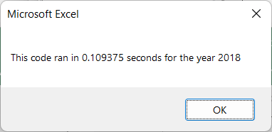

# stock-analysis

## Overview of the Project

### The objective of this project is to facilitate the users' analysis of various stocks over the course of a year. For both 2017 and 2018 there are over 3000 rows of data each. This code sorts through that large amount of data to pull the most relevant information and examine all the stocks' volume and percentage shift throughout the given year. The analysis has also been given a timer function to track the amount of time required to sift through the data and pull the information.

## Results

### The stock analysis focuses on the Daily Volume of each stock and the Percentage of the return on the year. In 2017, all but one stock had increased. Four stocks had increased by over 100%. The single stock that had a decreased return decreased by less than 10%. For 2017, the refactored script took 0.55 seconds to load as opposed to the original script which loaded in 0.53 seconds. See the below screenshot for a reference for the refactored code for 2017.

### Meanwhile in 2018, all but two stocks had decreased in value. Worth noting is that the stocks that had increased in value had increased each by over 80%. For the remaining 10 stocks, the increase range from 3.54% to decreases as large as 62%. For 2018 the refactored script took 0.55 seconds to load as opposed to the original script which loaded 0.56 seconds. See the below screenshot for a reference for the refactored code. 1

